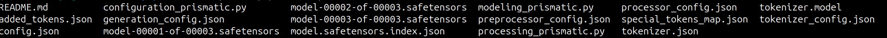
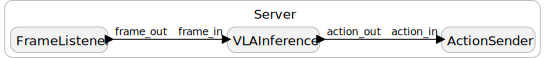
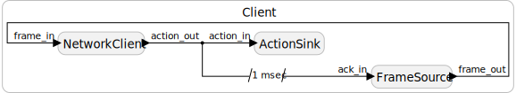

# VLA Timing — Distributed Reactors

Lingua Franca (LF) reactor programs for measuring end-to-end timing of a distributed VLA (vision-language-action) pipeline. 

[`src/Client.lf`](src/Client.lf) runs on the machine with the camera/image feed: it streams frames over a TCP socket to the server and waits for an action back before sending the next one. 

[`src/Server.lf`](src/Server.lf) runs on the GPU machine: it receives each frame, runs OpenVLA inference (via [`python_files/vla_inference_2.py`](python_files/vla_inference_2.py)), and sends the resulting action back over the same connection.

Currently, `Client.lf` and `Server.lf` are each fully standalone reactor programs. There's no shared coordinator process — build and run them independently, one per machine.

---

## Prerequisites

**Server machine** (runs `Server.lf` + OpenVLA inference):
- GPU with ≥16 GB VRAM
- System RAM ≥32 GB
- ~30 GB free disk space
- CUDA drivers installed (`nvidia-smi` should work)

**Client machine** (runs `Client.lf`):
- A folder of `.jpg` frames to stream (default: `images/`, next to wherever you run `bin/Client`)
- Network access to the server machine on the configured port (default `8080`)

**Both machines** need Python 3.10+ and the [Lingua Franca compiler](https://www.lf-lang.org/docs/installation) (`lfc`) — each machine compiles its own `.lf` file locally.

---

## 1. Install `lfc`

On **both** machines,

```bash
curl -Ls https://install.lf-lang.org | bash -s cli
```
Or if you have a ```permission denied``` error: 

```bash
curl -Ls https://install.lf-lang.org | sudo bash -s cli
```
For a more detailed guide, follow the [LF installation guide](https://www.lf-lang.org/docs/installation).

Then verify:

```bash
lfc --version
```

---

## 2. Create a virtual environment

On **both** machines:

```bash
python3 -m venv openvla-env
source openvla-env/bin/activate
```
The server (GPU system) may need Python3.10 certain packages. Hence it is better to use that specifically:

> ```bash
> sudo apt install python3.10 python3.10-venv
> python3.10 -m venv openvla-env
> source openvla-env/bin/activate
> ```

---

## 3. Install PyTorch — server machine only

The client never imports `torch`, so skip this step there.

**Important:** Standard PyTorch releases only support up to sm_90 (Hopper). Blackwell (sm_120) requires a nightly build with CUDA 13.0+.

```bash
pip install --pre torch torchvision torchaudio \
  --index-url https://download.pytorch.org/whl/nightly/cu130
```

Verify your GPU is working:

```bash
python -c "
import torch
print('PyTorch:', torch.__version__)
print('CUDA:', torch.version.cuda)
print('GPU:', torch.cuda.get_device_name(0))
print('Capability:', torch.cuda.get_device_capability(0))
x = torch.randn(3,3).cuda()
print('Kernel test passed:', (x @ x).shape)
"
```

Your GPU is working if you see the message ```Kernel test passed```.

---

## 4. Install dependencies

On **both** machines, from `distributed/`:

```bash
pip install -r requirements.txt
```

[`requirements.txt`](requirements.txt) covers everything except PyTorch (installed separately above since the index URL differs per platform):
- `transformers`, `timm`, `pillow`, `accelerate`, `huggingface_hub` — only exercised on the server (model loading + inference)
- `opencv-python`, `numpy` — used on both sides (`Client.lf` encodes frames, `Server.lf` decodes them)
- `pyserial` — for driving real hardware from the action output

> **Note:** Pin `transformers==4.40.1` and `timm>=0.9.10,<1.0.0` exactly — newer `transformers` breaks OpenVLA's custom model class, and `timm` 1.x raises `NotImplementedError`. `requirements.txt` already pins these.

---

## 5. Download the model — server machine only

```bash
huggingface-cli download openvla/openvla-7b \
  --local-dir ./models/openvla-7b
```

This downloads ~15 GB. Verify it completed:

```bash
ls ./models/openvla-7b/
# Should include: config.json, model.safetensors.index.json, tokenizer files
```
It should display something like this:


> **Note:** Do not use `attn_implementation="flash_attention_2"` — it should be built properly, we are skipping it for now.

---

## 6. Provide images — client machine only

`Client.lf` reads every `.jpg` from `images/` (relative to wherever `bin/Client` runs, i.e. `distributed/`), in natural/numeric sorted order. Either drop your own frames there, or grab the sample trajectory used elsewhere in this repo:

```bash
wget -r -np -nd -A "*.jpg,*.png" "https://rail.eecs.berkeley.edu/datasets/bridge_release/raw/bridge_data_v2/datacol2_toykitchen7/drawer_pnp/01/2023-04-19_09-18-15/raw/traj_group0/traj0/images0/" -P images/
```

---

## Running

`Client.lf` and `Server.lf` both default to `ip="10.218.100.78"`, `port=8080` — the server's real address. These are compile-time `main reactor` parameters, not CLI flags (the LF Python target doesn't expose runtime overrides for them), so if either machine's address changes, edit the `main reactor(...)` line at the bottom of the corresponding `.lf` file and recompile.

>NOTE: The current program shows the reactor based approach, and the IP for the socket connection is hardcoded into the files. You can change it to your
> machine and compile the programs.

### On the server (GPU / receiver) machine

```bash
cd distributed
lfc src/Server.lf
bin/Server
```

Loads the OpenVLA model once at startup, then listens on `<ip>:<port>` for frames. Restarts listening automatically if the client disconnects. For each frame received: runs inference, sends the action back on the same connection, and appends a row to `lag_log.csv` (physical-vs-logical clock lag per frame).

### On the client (camera / sender) machine

```bash
cd distributed
lfc src/Client.lf
bin/Client
```

Connects to the server (retrying until it's reachable), then streams frames from `images/` one at a time — each next frame is only sent after the action reply for the previous one arrives, so the two sides stay in lockstep. Appends a row to `timing_log.csv` per frame with the round-trip elapsed time.

Start the server first — the client will retry the connection until the server is listening, but there won't be anything on the other end otherwise.

---

## Diagrams

Reactor graphs for the current `Client.lf` / `Server.lf` topology (titles in the images reflect an earlier filename, `send_clnt_reactors`/`recv_serv_reactors`, but the reactor structure shown is current):

**`src/Server.lf`** — `FrameListener` → `VLAInference` → `ActionSender`



**`src/Client.lf`** — `FrameSource` ⇄ `NetworkClient` → `ActionSink`, with the action reply looped back to `FrameSource` as the trigger for the next frame



---

## Output

The output log files in the client side gives the total delay taken for the frames to be sent and the action values to be received. On the server side, a log file with the lag of the inference is also produced. The end-effector points for the robot is the final output that the client receives after sending the frames.


