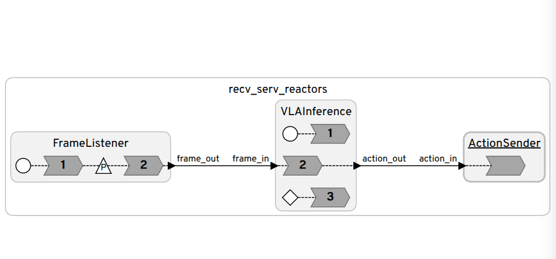
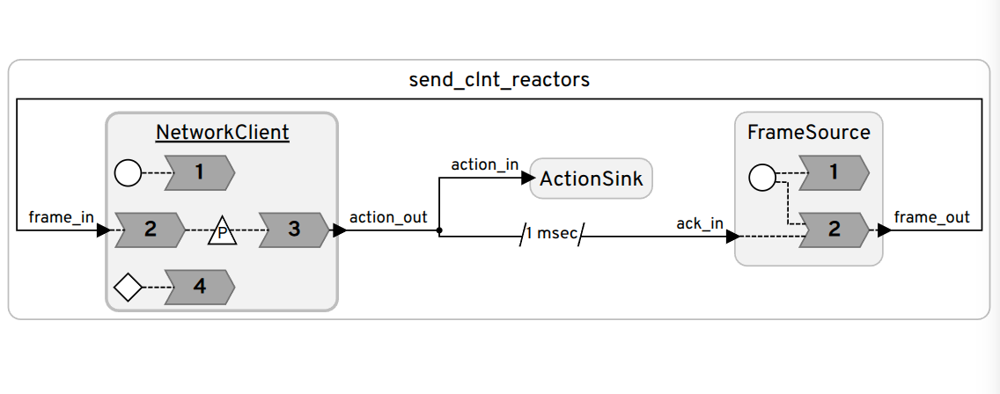

# VLA Timing — Distributed Reactors

Lingua Franca (LF) reactor programs for measuring end-to-end timing of a distributed VLA (vision-language-action) pipeline: `send_clnt_reactors.lf` streams frames over a socket to `recv_serv_reactors.lf`, which runs VLA inference and sends the action back.

## Running

```bash
# On the receiver/server machine
lfc recv_serv_reactors.lf
bin/recv_serv_reactors

# On the sender/client machine
lfc send_clnt_reactors.lf
bin/send_clnt_reactors
```

Set `ip`/`port` as target parameters (or edit the defaults in the `.lf` files) so both sides point at the same address.

## Diagrams

**`recv_serv_reactors.lf`**


**`send_clnt_reactors.lf`**

